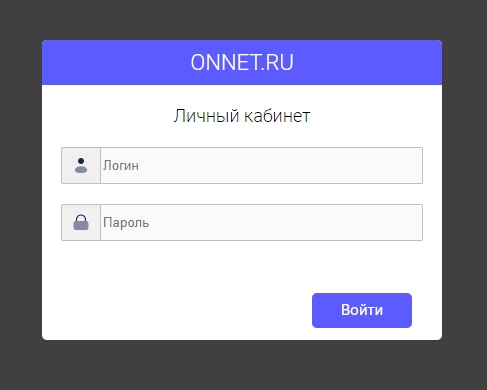

# Website and Billing Cabinet (ISP)

Один из недавних коммерческих проектов, личный кабинет для пользователей провайдера связи и веб-сайт

* сайт Flask + SQLite + Админ панель
* личный кабинет FastAPI + async Billing API(httpx, bs4)
* обслуживание статики и SSL на Nginx
* все завернуто в контейнеры (Docker compose)

#### Отдельные репозитории проектов:
* личный кабинет [onnet_cabinet]()
* веб сайт [onnet_web]()


#### Frontend (onnet_web)
* классика html, css, javascript (jquery)
* многостраничник
* шаблонизация jinja2

#### Frontend (onnet_cabinet)
* классика html, css, javascript
* выполнен в SPA стиле (only JS)
* ajax JSON


#### Схема проекта


## Установка и запуск
клонируем
```
git clone https://github.com/sita8281/onnet_services.git
```

> **Warning**
Перед запуском отредактировать проброс портов в docker-compose.yml

Переходим в корень проекта и собираем образы
```
sudo docker compose build
```
Запускаем
```
sudo docker compose up
```

## Demo (onnet_cabinet)
вход в личный кабинет



возможности личного кабинета


## Demo (onnet_web)


